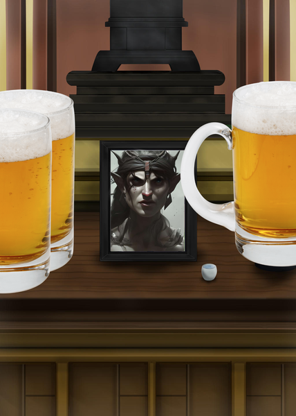

## **Noticias del exterior**

De vuelta en [Kasoon](../Lugares/Kasoon.md), después de la fructuosa misión en [Inten](../Lugares/Inten.md), los aventureros descubren que se ha formado un tremendo revuelo. La ciudad está abarrotada de grupos de exploradores; y todos estan reunidos frente al Gremio. Con las calles repletas, el grupo no puede avanzar, y se ve obligado a preguntar qué está pasando. De repente, una voz, claramente aumentada por un hechizo de magia para que sea audible en toda la ciudad, de alguien que no sois capaces de ver debido al tumulto de gente, empieza a hablar:

*"¡EXPLORADORES, HEROES Y AVENTUREROS! TENEMOS UN GRAVE PROBLEMA. PUEDE QUE ALGUNOS YA ESTEIS AL CORRIENTE, PERO ES MI DEBER INFORMAR DE LAS CATÁSTROFES QUE ESTÁN ASOLANDO NUESTRO MUNDO. PRIMERO, FUE EL TERREMOTO DE FENESTRO, LUEGO, LA INGENTE INFESTACIÓN DE MONSTRUOS, Y AHORA... UN TSUNAMI HA BORRADO AMIHS DE LA FAZ DE LA TIERRA. 
PUEDEN PARECER HECHOS AISLADOS, PERO DESDE LA ESCUELA DE HECHIZERÍA DE [SEVERNAYA](../Lugares/Severnaya.md), EL GRAN VIDENTE [DROSS](../Personajes/Dross.md) HA VATICINADO EL FIN DEL MUNDO. POR ELLO, EN TODAS LAS CIUDADES, SE ESTÁ EXTENDIENDO EL MENSAJE. HAY QUE AVERIGUAR QUE ESTÁ PASANDO, QUÉ PROVOCA LAS CATÁSTROFES, Y ENCONTRAR UNA MANERA DE EVITAR EL FUTURO DESOLADOR. ¡ESTA MISION TIENE LA MÁXIMA PRIORIDAD!"*

## **Males menores**

Impactado por la noticia, [3zYqPn3](../Personajes/Personajes%20Jugables/3zYqPn3%20UcHiW4.md) se da una vuelta por [Kasoon](../Lugares/Kasoon.md), en busca de una mujer a la que seducir. Tras varios intentos fallidos conoce a una atractiva enana, y se la lleva de vuelta a la taberna. Durante los preeliminares, 3zYqPn3 se entera de que su acompañante es menor de edad, y la pareja es interrumpida bruscamente ante el tío de la enana, que también se hospedaba en la taberna. 

Tras un violento altercado en el que el elfo no sale bien parado, la guardia aparece y el equipo debe abandonar la ciudad. Desprovistos de un lugar seguro de descanso, deciden emprender el viaje hacia [Butte](../Lugares/Butte.md) para ofrecer sus servicios eliminando a un grupo de ladrones que está atemorizando a la localidad. Tras un trueque rápido con un comerciante ambulante a las puertas de Kasoon, el grupo empieza la marcha.

---
## **Lágrimas en Butte**

Ya en Butte, los aventureros se encuentran una villa simple y de aspecto vulnerable, unas casas ennegrecidas y mohosas, y unos aldeanos recelosos con las caras nuevas. El grupo se reúne con los gobernantes, que les ponen al día: Un grupo de ladrones se ha asentado por los alrededores, y se dedican a saquear regularmente la villa. Tras negociar, los aventureros aceptan el encargo, y van a la taberna local para prepararse. 3zYqPn3 conoce a [Destra](../Personajes/Destra.md), una mujer de la villa, y consigue satisfacer sus deseos carnales reprimidos desde su desventura en Kasoon. 

El equipo, desde la taberna, empieza con los preparativos para enfrentarse a los saqueadores. Trazan un plan: [Belka](../Personajes/Personajes%20Jugables/Belka%20Poparrosa.md) va a hacerse pasar por una nueva recluta del grupo de saqueadores para encontrar algún punto débil. 

Belka y el resto del grupo parten en busca del refugio de los saqueadores. Tras unas horas, dan con lo que estan buscando: se encuentran con un numeroso grupo de bandidos, que ríen y se jactan de lo robado a la villa. El plan se pone en marcha, y Belka se acerca a los ladrones. Aunque sospechan de ella, le ponen un reto para demostrar su lealtad: robarle a los gobernantes de Butte. Pero antes de que pueda planteárselo, [Sigrid](../Personajes/Personajes%20Jugables/Sigrid.md) lidera una emboscada al refugio acompañada del resto de aventureros. Aunque superados en número, el grupo peleó hasta el límite de sus fuerzas y poco a poco empezaron a caer, hasta el momento en el que sólo quedaron dos en pie: Belka, y el capitán de la banda. Belka, rápidamente, pudo ayudar a varios de sus compañeros y finalmente pudieron acabar con el último bandido.

Pero, mientras se levantaban poco a poco, una sombra apareció en sus caras: Sigrid no reaccionaba. El grupo se puso alrededor suya, escondiendo las lágrimas mientras Sigrid pronunciaba sus últimas palabras con un grito desgarrador que pareció recorrer el mundo entero. Quemaron su pesado cuerpo como pudieron y se guardaron sus cenizas.

Desolados, los tres compañeros restantes, acompañados por un alicaído [Kypros](../Personajes/Kypros.md), regresaron a Butte para dar las "buenas" noticias: la villa estaba a salvo. Como agradecimiento, los gobernantes de Butte dispusieron un altar en honor a Sigrid, su salvadora. Aquella noche, mientras casi todo el mundo festejaba, tres jarras de cerveza fría fueron derramadas sobre el altar de Sigrid, acompañadas de una plegaria y una promesa de venganza.

